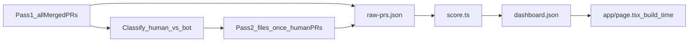

# Engineering-impact dashboard — implementation plan

## Confirmation of understanding

This is a **single laptop-page** briefing for a busy PostHog eng leader: who the top 5 humans are and **why**, using a 4-dimension composite (not loc / commit / PR-count vanity metrics). Audience already knows the org; they will not read every PR.

Non-negotiables I will follow:

- Fetch **all** merged PRs in the window (~15k+), classify **human vs bot/automation**, show that split for completeness.
- Score **only the human-authored subset** (plus human reviewers who meet eligibility).
- **One offline fetch**; Next.js reads static JSON at **build time**. No GitHub calls on visit. Target load **&lt;1s**.
- Composite: Delivery 40% + Scope/Leverage 25% + Multiplier 20% + Risk/Reliability 15%, scaled 0–100.
- You supplied the Pass 1 / Pass 2 GraphQL. Pass 1 is implemented and has been run. Pass 2 is **not** executed until you confirm.
- Scoring proxies **A–H are SIGNED OFF** (2026-09-11). Formulas below are locked. Do not invent additional proxies.

**Eligibility (your answer):** top 5 among humans with **≥2 merged PRs as author** OR **≥5 reviews across distinct authors** in the window. Org-membership filter is **not** applied.

**Current app:** vanilla Next.js 16.3.4 App Router + React 19 + Tailwind 4. Only [`app/page.tsx`](app/page.tsx), [`app/layout.tsx`](app/layout.tsx), [`app/globals.css`](app/globals.css). `resolveJsonModule` is already on. No `scripts/`, `data/`, or `plan/` yet.

**Explicitly deferred:** Pass 2 file-path batches — waiting for manual confirmation after Pass 1 stop.

---

## Target file structure

```
plan/
  implementation.md          # this plan, checked into the repo when you say to write files
scripts/
  fetch.ts                   # orchestrator: pass 1 → pass 2 → write raw JSON → score → write dashboard JSON
  github-client.ts           # token, POST to api.github.com/graphql (query body comes next prompt)
  classify-author.ts         # human vs bot/automation
  score.ts                   # reads raw JSON, writes dashboard JSON (no network)
data/
  raw-prs.json               # gitignored; full two-pass payload (all PRs + files once)
  dashboard.json             # what Next.js imports; completeness + eligible cohort scores + top-5 evidence
lib/
  types.ts                   # shared TypeScript types for both JSON files
  load-dashboard.ts          # server-only import of dashboard.json
app/
  page.tsx                   # Server Component: load JSON, compose the page
  layout.tsx                 # title/description for the briefing
  globals.css                # keep Tailwind; compact laptop layout tokens
  components/
    Headline.tsx             # title, window, human/bot split
    RankedList.tsx           # the 5 cards
    EngineerCard.tsx         # client: expand/collapse evidence
    DimensionBreakdown.tsx   # 4 bars + weights
    EvidenceList.tsx         # linked PRs / reviews / path evidence
    MethodologyFooter.tsx    # how scores were built + caveats
```

`data/raw-prs.json` is an intermediate so we can re-score without re-fetching. The page **only** imports [`data/dashboard.json`](data/dashboard.json). That is the “static JSON file” the assignment requires for runtime.

Add `npm run fetch` → `npx tsx scripts/fetch.ts`. Add `data/raw-prs.json` to `.gitignore`. Commit `dashboard.json` so `next build` does not need a token.

---

## Two-pass fetch (files only; queries next)



**Pass 1 — census (all ~15k, required):** every merged PR in the last 90 days from fetch time. Per PR, persist at least:

- identity: `number`, `url`, `title`, `mergedAt`
- author: `login`, `name`, `avatarUrl`, GraphQL typename / bot flag
- issue-closing: `closingIssuesReferences.totalCount` (and issue numbers if cheap)
- labels: `name`
- reviews: `author.login`, `state` (APPROVED / CHANGES_REQUESTED / COMMENTED), `submittedAt` — collected here so multiplier does not need a third network pass
- **not** file paths yet

Then classify `authorType`: `human` | `bot`. Count both. Bots stay in the file for the completeness readout; they are excluded from scoring.

**Pass 2 — files once (human-authored PRs only):** attach `files: string[]` (paths only) to each human PR. **One** files connection per PR. Dim 1 uses paths only for the docs/lockfile downweight; dim 2 and dim 4 use the same array for taxonomy. Do not fetch files for bot PRs. Do not re-query files per dimension.

Orchestrator writes `data/raw-prs.json`, then runs `score.ts` in-process to write `data/dashboard.json`.

**Bot rule (signed off):** `author.__typename === "Bot"` or login ending in `[bot]`. No commit-email guessing. Optional named denylist only if you add accounts later.

---

## JSON shapes

### `data/raw-prs.json` — feeds all four dimensions from one files array

```ts
type RawPayload = {
  meta: {
    repo: "PostHog/posthog";
    windowStart: string; // ISO
    windowEnd: string;
    fetchedAt: string;
    totals: { prs: number; human: number; bot: number };
  };
  pullRequests: Array<{
    number: number;
    url: string;
    title: string;
    mergedAt: string;
    authorLogin: string;
    authorName: string | null;
    avatarUrl: string | null;
    authorType: "human" | "bot";
    labels: string[];
    closedIssueCount: number;
    closedIssueNumbers: number[];
    files: string[]; // empty until pass 2; bots stay []
    reviews: Array<{
      authorLogin: string;
      state: "APPROVED" | "CHANGES_REQUESTED" | "COMMENTED" | "DISMISSED";
      submittedAt: string;
    }>;
  }>;
};
```

Scoring never calls GitHub. It joins:

- Dim 1: authored human PRs + `closedIssueCount` + `files` only to detect docs/lockfile-only
- Dim 2: `files` via the signed-off directory taxonomy (unclassified dirs ignored here)
- Dim 3: `reviews[].authorLogin` on human PRs **not** authored by that person
- Dim 4: `files` + `labels` via the signed-off reliability/security/CI rules

### `data/dashboard.json` — page input (small)

```ts
type DashboardPayload = {
  meta: RawPayload["meta"] & {
    eligibleHumanCount: number;
    eligibility: "human AND (>=2 merged PRs authored OR >=5 reviews across distinct authors)";
  };
  top5: Array<{
    rank: 1 | 2 | 3 | 4 | 5;
    login: string;
    name: string | null;
    avatarUrl: string | null;
    composite: number; // 0–100
    dimensions: {
      delivery: { score: number; weight: 0.4 };
      leverage: { score: number; weight: 0.25 };
      multiplier: { score: number; weight: 0.2 };
      reliability: { score: number; weight: 0.15 };
    };
    why: string; // 1–2 sentence leader summary
    evidence: {
      delivery: Array<{ prNumber: number; url: string; title: string; note: string }>;
      leverage: Array<{ pathPrefix: string; prCount: number; note: string }>;
      multiplier: Array<{ prNumber: number; url: string; reviewState: string; note: string }>;
      reliability: Array<{ prNumber: number; url: string; title: string; note: string }>;
    };
  }>;
};
```

Page does not iterate 15k PRs. Completeness is `meta.totals` only.

---

## Scoring pipeline (signed off)

1. Build per-login stats from `raw-prs.json`.
2. Drop bots. Keep humans matching eligibility (≥2 merged PRs authored OR ≥5 reviews across distinct authors).
3. Compute four raw dimension values from the locked formulas in **Signed-off scoring rules**.
4. Min–max each dimension to 0–100 across the eligible cohort.
5. `composite = 0.40*d1 + 0.25*d2 + 0.20*d3 + 0.15*d4`. Ties: higher Delivery, then higher Multiplier.
6. Sort, take 5, attach at most 3 evidence items per dimension per person.

**Direct GitHub fields:** merged PR identity, author, `closingIssuesReferences`, review author/state, file **paths** as raw strings, labels as raw strings. Impact meaning comes only from the signed-off rules.

---

## Page component structure (one laptop screen)

[`app/page.tsx`](app/page.tsx) stays a **Server Component**: import dashboard JSON, pass `top5` + `meta` down. No fetch, no client wrapper around the whole page.

Vertical layout, collapsed by default so five cards + headline + footer fit:

1. **Headline** — “Highest-impact engineers, last 90 days” + date window + `human / bot / total` completeness (e.g. “14,200 human-authored · 1,100 bot/automation · 15,300 merged PRs scored from a full census”).
2. **RankedList** — five **EngineerCard**s: rank, avatar, name, composite, one-line `why`.
3. **Per-person DimensionBreakdown** — four labeled bars with weights; visible on the card without expanding.
4. **Expandable evidence** — `EngineerCard` is `"use client"` with one open card at a time. Links to GitHub PRs. No loc/commit/file-count as the story.
5. **MethodologyFooter** — weights, eligibility, human/bot rule, signed-off proxies, and the unclassified-path caveat (`playwright/`, `funnel-udf/`, `share/`, `tools/`, `patches/` receive baseline delivery only; `packages/*` is a weak leverage signal).

Basic, dense UI. Analysis lives in `why` + evidence, not in chrome.

---

## What I will not do until the GraphQL prompt

- Write application or script code.
- Invent GraphQL or a pagination strategy.

After that prompt: implement fetch, score with the locked formulas, then the page.

---

# Signed-off scoring rules (locked 2026-09-11)

Do not add proxies. Do not restore the dropped dim-1 directory-span bonus.

### A. Bot / automation — APPROVED

Treat as bot if `author.__typename === "Bot"` or `login` ends in `[bot]`. Do not infer bots from commit email. Named denylist only if you add accounts later.

### B. Delivery Significance (40%) — APPROVED as amended

**No directory-span bonus.** Directory breadth is dim 2 only.

Per authored merged human PR:

- base `1`
- `+1` if `closedIssueCount ≥ 1`
- if **every** path is docs/lockfile/changelog (`docs/`, `*.md`, `CHANGELOG*`, `package-lock.json`, `pnpm-lock.yaml`, `yarn.lock`), scale that PR’s contribution by `0.25`

Author raw delivery = sum of those per-PR values. Then min–max to 0–100.

### C. Technical Scope & Leverage (25%) — APPROVED as amended

- **Shared / infra (weight 2):** `.github/`, `docker/`, `Dockerfile*`, `docker-compose*`, `terraform/`, `bin/`, `devenv/`, `common/`, `proto/`
- **Product / team buckets (weight 1):** `frontend/`, `posthog/`, `ee/`, `products/<name>/`, `rust/`, `nodejs/`, `cli/`, `livestream/`, `services/`
- **Weak leverage (weight 0.5):** `packages/` as a **single** bucket (only two packages; not 2× infra)
- **Unclassified (weight 0 on this dimension):** `playwright/`, `funnel-udf/`, `share/`, `tools/`, `patches/` — still count in dim 1 delivery; **flag in MethodologyFooter** as “baseline delivery only”

Raw leverage = sum of unique-bucket weights for that author (`unique product buckets × 1 + unique infra buckets × 2 + packages bucket × 0.5`). Then min–max to 0–100.

### D. Engineering Multiplier (20%) — APPROVED

- Reviews where reviewer ≠ PR author, PR is human-authored, reviewer is human
- Weights: `CHANGES_REQUESTED` = 2, `COMMENTED` = 1.5, `APPROVED` = 1, `DISMISSED` = 0
- Distinct-author count is eligibility only (≥5), not the score
- Reviews on bot PRs do not count

### E. Risk & Reliability (15%) — APPROVED

A PR counts if any file **or** any label matches (case-insensitive):

- **CI/CD:** `.github/`, `.husky/`, `Dockerfile*`, `docker-compose*`, `.semgrep/`
- **Security:** path or label contains `security`, `auth`, `cve`, `secret`; or path under `.semgrep/`
- **Reliability:** `rust/`, `livestream/`, `terraform/`, `clickhouse` in path, `dagster`, `otel`, label `reliability` / `incident` / `hotfix`

Author raw value = count of such authored PRs (not loc). Then min–max to 0–100.

### F. Normalization — APPROVED

Min–max each dimension across the eligible cohort, then weighted sum. Ties: higher Delivery, then higher Multiplier.

### G. Time window — APPROVED

`[fetchedAt - 90d, fetchedAt]`, `mergedAt` in range.

### H. Evidence size — APPROVED

At most 3 items per dimension per person.
